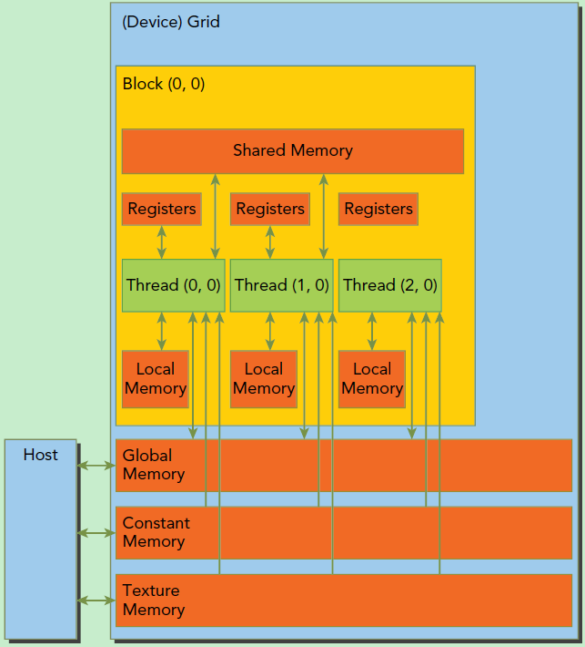

<!--
 * @Author: Albresky albre02@outlook.com
 * @Date: 2025-08-15 13:01:12
 * @LastEditors: Albresky albre02@outlook.com
 * @LastEditTime: 2025-08-15 19:10:56
 * @FilePath: /cuda/toy/gemm/README.md
 * @Description: 优化策略
-->

## 基础：CUDA 模型回顾

### 执行模型 (Grid, Block, Thread)

**Grid**

整个 Kernel 启动，由许多个 Block 组成。代表了你要解决的整个问题 (例如，计算整个 C 矩阵)。

**Block**

一个线程块，由许多个 Thread 组成。同一个 Block 内的所有线程可以相互协作，因为它们可以访问同一块**共享内存 (Shared Memory)**, 并且可以进行同步 (\_\_syncthreads ())。

**Thread**

最基本的执行单元。每个线程有自己私有的寄存器 (Registers)。

### 内存模型 (Global, Shared, Registers)

**Global Memory (全局内存)**

位于 GPU 的 DRAM 上。容量最大 (GB 级别)，但速度最慢，延迟最高。所有的线程都可以读写。你的输入矩阵 A, B 和输出矩阵 C 都存放在这里。

**Shared Memory (共享内存)**

位于每个 SM (流式多处理器) 的片上。容量很小 (KB 级别)，但速度极快，延迟极低，几乎和 L1 缓存一样快。生命周期和作用域都仅限于一个 Block。

**Registers (寄存器)**

位于 SM 的计算单元内。容量最小，但速度最快。每个线程私有。函数内的局部变量 (如 Cvalue) 通常就存放在寄存器中。

优化的核心思想：最大限度地减少对慢速全局内存的访问，并尽可能地利用快速的共享内存和寄存器来重用数据。

## NCU 使用

---

### Level 0: 基线实现 (`mmKnlL0`)

这是最直观、最朴素的实现。

#### 1. 映射关系 (Grid/Block/Thread)

- **目标**: 计算 C 矩阵中的每一个元素。
- **策略**: **一个 Thread 计算一个 C 矩阵的元素**。
- **Grid**: 设置为一个二维的网格，其维度与输出矩阵 C 的维度 (M x N) 相匹配。例如，一个 1024x1024 的 C 矩阵会启动一个 1024x1024 的线程网格 (逻辑上)。
- **Block**: Grid 被划分为一个个 Block (例如，32x32 的 Block)。
- **Thread**: `row = blockIdx.y * blockDim.y + threadIdx.y;` 和 `col = ...` 这两行代码的作用就是给每个线程分配一个独一无二的 `(row, col)` 坐标，让它 “认领” C 矩阵中的 `C[row][col]` 这个元素。

#### 2. 内存工作流程

1. 每个线程在自己的**寄存器**中声明一个累加器 `Cvalue`。
2. 进入 `for (int k = 0; k < A.K; ++k)` 循环。在**每一次**循环中：
   - 线程从**全局内存**中读取一个 A 的元素 (`A.elements[row * A.K + k]`)。
   - 线程从**全局内存**中读取一个 B 的元素 (`B.elements[k * B.N + col]`)。
   - 在线程的计算单元内进行乘法和加法，结果更新到寄存器 `Cvalue` 中。
3. 循环结束后，线程将最终结果 `Cvalue` 从**寄存器**一次性写回到**全局内存**的 `C.elements[row * C.N + col]`。

#### 3. 性能瓶颈

- **极高的全局内存流量**: 为了计算 `C[row][col]` 一个元素，需要从全局内存读取 `K` 个 A 的元素和 `K` 个 B 的元素，总共是 `2 * K` 次全局内存读取。对于整个矩阵，总读取次数是 `M * N * 2 * K`，这是一个天文数字。
- **毫无数据重用**:
  - 计算 `C[row][col]` 的线程读取了 A 矩阵的第 `row` 行。
  - 计算 `C[row][col+1]` 的线程也**完完整整地重新读取了一遍** A 矩阵的第 `row` 行。
  - 同理，计算 `C[row][col]` 和 `C[row+1][col]` 的线程都重复读取了 B 矩阵的第 `col` 列。
  - 这些重复的读取都是通过慢速的全局内存，性能极差。**这是 L0 最致命的缺陷**。

---

### Level 1: 使用共享内存进行 Tiling (`mmKnlL1`)

这个级别引入了 CUDA 优化的第一个核心思想 \*\*：Tiling (分块)\*\*。

#### 1. 映射关系 (Grid/Block/Thread)

- **目标**: 不再让线程各自为战，而是让一个 Block 的线程**协作**计算 C 矩阵的一个 **Tile (块)**。一个 Tile 是 C 矩阵的一个 `BLOCK_SIZE x BLOCK_SIZE` 大小的子矩阵。
- **Grid**: 仍然是一个二维网格，但现在它代表的是 C 矩阵被划分成的 **Tile 网格**。
- **Block**: 一个 `BLOCK_SIZE x BLOCK_SIZE` 的线程块，负责计算 C 矩阵中一个同样大小的 Tile。
- **Thread**: Block 内的每个线程，仍然负责计算其所属 C-Tile 中的一个元素。

#### 2. 内存工作流程

1. **协作加载**: `for (int i = 0; i < numTiles; ++i)` 循环，遍历 A 的行和 B 的列方向上的 Tile。在每一次大循环中：
   - Block 内的所有线程一起行动，从**全局内存**中，将计算当前 C-Tile 所需的一个 A-Tile 和一个 B-Tile，加载到**共享内存** `sA` 和 `sB` 中。每个线程负责加载其中一两个元素。
2. **同步**: `__syncthreads()` 是一个栅栏。所有线程必须在这里等待，直到**所有**线程都完成了从全局内存到共享内存的数据加载。这确保了 `sA` 和 `sB` 中的数据是完整的。
3. **从共享内存计算**: `for (int k = 0; k < BLOCK_SIZE; ++k)` 内部循环开始。现在，所有线程都从**极快的共享内存** `sA` 和 `sB` 中读取数据进行计算。
4. **再次同步**: 在加载下一个 Tile 之前，需要再次同步，确保当前 Tile 的计算已经全部完成，防止快的线程提前加载数据，污染了慢的线程还在使用的共享内存。
5. **写回**: 所有 Tile 都计算完毕后，每个线程将最终结果写回**全局内存**。

#### 3. 性能提升

- **大幅降低全局内存流量**: A 和 B 中的每个元素，不再是被需要它的每个线程都去全局内存里读一遍。而是被一个 Block 加载到共享内存**一次**，然后被 Block 内的 `BLOCK_SIZE` 个线程**重复使用**。全局内存的读取次数大约降低到了原来的 `1 / BLOCK_SIZE`。
- **实现了数据重用**: **共享内存**在这里扮演了一个由程序员手动管理的高速缓存。

---

### Level 2: 增加单线程计算量 (`mmKnlL2`)

L1 已经很好了，但仍有优化空间。L1 中每个线程只计算 1 个最终结果。这意味着为了这 1 个结果，它还是需要从共享内存读取 `2 * BLOCK_SIZE` 个值。我们可以让每个线程承担更多工作，从而更好地利用寄存器。

#### 1. 映射关系 (Grid/Block/Thread)

- **目标**: 让每个线程计算一个更小的 C 矩阵**子块** (例如 8x4)，而不是单个元素。
- **Grid/Block**: 和 L1 类似，一个 Block 仍然负责计算 C 矩阵的一个 Tile (例如 32x32)。
- **Thread**: **这是核心变化**。一个 Block 内的线程数减少了 (例如变成 8x4=32 个线程)。每个线程不再计算 1 个元素，而是负责计算一个 `THREAD_ROWS x THREAD_COLS` (8x4) 的矩形区域。它使用一个二维数组 `Creg[8][4]` 来存储这 32 个结果的中间值。

#### 2. 内存工作流程

1. **协作加载**: 和 L1 一样，一个 Block 的线程协作将 A-Tile 和 B-Tile 从**全局内存**加载到**共享内存** `sA` 和 `sB`。加载逻辑更复杂一些，因为线程数变少了，每个线程要加载更多数据。
2. **同步**: `__syncthreads()`，作用同 L1。
3. **从共享内存到寄存器进行计算**: 这是 L2 的精髓。
   - 在 `for (int k = 0; k < TILE_DIM; ++k)` 循环中，每个线程从共享内存 `sA` 和 `sB` 中为它的 8x4 子块加载一行和一列的数据。
   - 然后，它用这些数据来更新它私有的、位于**超高速寄存器**中的 `Creg[8][4]` 数组。
   - 对于从共享内存读取的每一个元素，线程现在用它来执行 `THREAD_ROWS * THREAD_COLS` (8\*4=32) 次计算。
4. **写回**: 所有 Tile 处理完毕后，每个线程把它寄存器数组 `Creg` 中的 32 个结果，一次性写回到**全局内存**中对应的位置。

#### 3. 性能提升

- **提高了计算 / 访存比**: L1 中，线程每次从共享内存读取数据只为 1 次乘加运算服务。L2 中，线程每次从共享内存读取数据，是为了更新寄存器中一个区域 (例如 8x4=32 个值) 的计算服务的。这大大提高了算法的**算术强度 (Arithmetic Intensity)**，能更好地隐藏访存延迟。
- **充分利用寄存器**: 将 C 矩阵的子块结果直接累加在寄存器中，避免了中间结果读写共享内存甚至全局内存的开销，这是最快的存储方式。
- **减少了线程切换开销**: 使用更少的线程完成同样的工作量，可能有助于调度。

### 总结对比

| 特性        | Level 0 (基线)             | Level 1 (Tiling)          | Level 2 (Register Blocking) |
| :-------- | :----------------------- | :------------------------ | :-------------------------- |
| **单线程任务** | 计算 C 矩阵的 **1 个元素**       | 计算 C-Tile 的 **1 个元素**     | 计算 C-Tile 的 **1 个子块 (8x4)** |
| **主要数据源** | **全局内存 (Global Memory)** | **共享内存 (Shared Memory)**  | **共享内存 & 寄存器**              |
| **数据重用**  | **无**，大量重复访问全局内存         | **有**，通过共享内存重用 A/B 的 Tile | **极高**，通过寄存器最大化重用共享内存数据     |
| **性能瓶颈**  | 全局内存带宽                   | 共享内存带宽和计算延迟               | 计算单元的吞吐量 (理想状态)             |
| **核心思想**  | 直观实现                     | Block 协作，共享内存做缓存          | 单线程负责更多计算，寄存器做缓存            |

从 L0 到 L2 的演进，是一个不断将数据从慢速、大容量内存向快速、小容量内存迁移，并最大化利用每一层级数据重用性的经典优化过程。
问得非常好！这是一个非常典型且关键的性能优化教训 \*\*：更复杂的算法不一定就更快。\*\* 🐢💨

你的 L3 (双缓冲) 实现之所以比 L2 慢了一倍，主要有两个原因叠加造成的 \*\*：资源争用 \*\* 和 **指令开销**。

---

### Level 3: 使用双缓冲来 pipeline 指令

#### 1. 因资源占用过高导致的占用率 (Occupancy) 降低

这很可能是最主要的原因，可以理解为你撞上了 “资源墙”。

- **共享内存是稀缺资源**：GPU 上的每个流式多处理器 (SM) 拥有的共享内存是固定且有限的 (例如，根据架构不同，可能是 48KB, 64KB 或 96KB)。这块内存必须由所有同时在该 SM 上运行的线程块 (Block) 来瓜分。
- **L2 的内存占用**：你的 L2 Kernel 每个线程块使用 `sA[32][32]` 和 `sB[32][32]`，总共是 `(1024 + 1024) * 4字节 = 8 KB` 的共享内存。
- **L3 的内存占用**：你的 L3 Kernel 为了实现双缓冲，将这个用量**翻了一倍**，达到了 `2 * 8 KB = 16 KB`。

**这会带来什么后果？**
假设一个 SM 拥有 48KB 的共享内存，理论上它可以同时运行 `48 / 8 = 6` 个 L2 的线程块。但对于 L3，它只能同时运行 `48 / 16 = 3` 个线程块。

这种 SM 上并发线程块数量的减少，就叫做**占用率 (Occupancy) 降低**。高占用率对于隐藏延迟至关重要 —— 当一个 Warp (线程束) 因为等待内存而停顿时，SM 可以立刻切换到另一个来自不同 Block 的、已经就绪的 Warp 去执行。通过将活跃的 Block 数量减半，你让 SM 可选择的 “备胎” Warp 变少了，从而导致了更多的空闲等待时间。

我们可以用一个厨房里的厨师来打比方：

- **L2 (高占用率)**：厨师同时在做 6 道菜。当一道菜在炖着的时候，他可以去为另一道菜切菜。总有活儿可干，效率很高。
- **L3 (低占用率)**：厨师只做 3 道菜，但每道菜都占用了双倍的台面空间。当这 3 道菜都在炖着的时候，厨师除了等待之外无事可做，效率就降低了。

---

#### 2. 增加的指令和逻辑开销

你的 L3 Kernel 在逻辑上比 L2 复杂得多。

- **更多的指令**：它有一个预加载阶段、一个带有复杂缓冲区索引切换 (`i % 2`) 的主循环，以及一个用于计算最后一个 Tile 的收尾循环。所有这些都转化为了需要 GPU 执行的更多的机器指令。
- **寄存器压力**：更复杂的逻辑、指向不同缓冲区的指针、以及循环计数器等，会增加 “寄存器压力”。这意味着编译器可能不得不将一些变量从速度飞快的寄存器中 “溢出” 到较慢的本地内存中，从而损害性能。
- **编译器挑战**：虽然双缓冲的目标是重叠计算和内存访问，但编译器可能无法完美地调度指令来实现这种重叠，特别是当计算部分本身不够耗时，无法完全掩盖内存延迟时。

从本质上讲，你为了管理双缓冲而付出的额外工作，最终比你试图隐藏的延迟本身还要耗时。管理两个缓冲区的 “行政开销” 超过了它带来的收益。

这是一个非常好的实验结果，因为它教会了你要成为一个批判性的性能分析师。下一步不仅仅是增加复杂性，而是要使用像 **NVIDIA Nsight Compute (`ncu`)**                                                                                这样的性能分析工具，在选择下一个优化策略之前，_证&#x660E;_&#x74F6;颈到底在哪里。